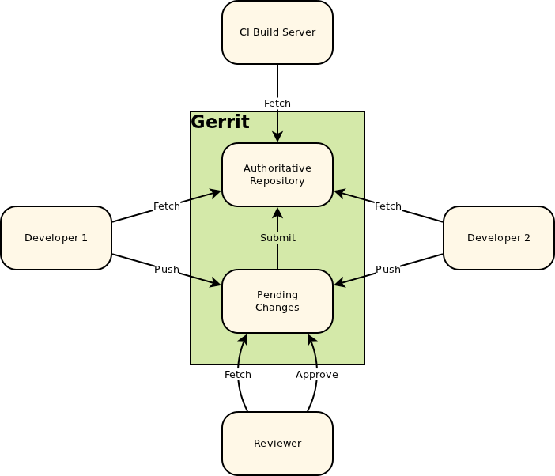
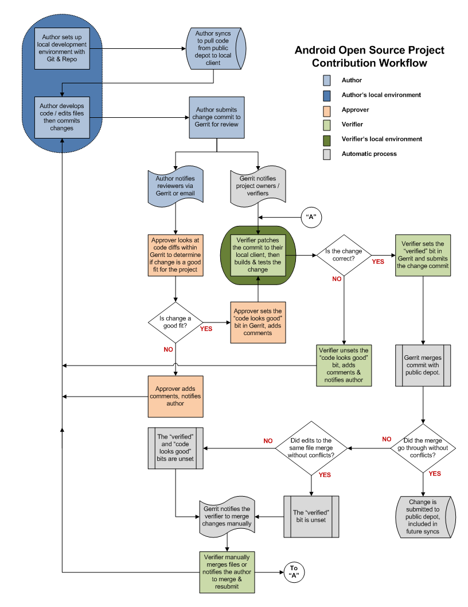

# gerrit
[gerrit](http://code.google.com/p/gerrit/)

# gerritとは
コードレビューシステム。git + ciサーバと組み合わせると非常に強力なツールとなる。

# インストール
* jdk ver1.6以上インストール
* [gerrit](http://code.google.com/p/gerrit/downloads/list)をダウンロード
* dbセットアップ(デフォルトH2)

#クライアント設定

## SSH
クライアントはSSH KEYの設定が必要です。

## SSHキー生成コマンド
    ssh-keygen -t rsa
    
# gerrit構成

# ワークフロー

# ~/.ssh/config
    Host tr
      Hostname git.example.com
      Port 29418
      User john.doe

# .git/config
    [remote "for-a-exp"]
      url = tr:kernel/common
      receivepack = git receive-pack --reviewer=a@a.com --cc=b@o.com
      push = HEAD:refs/for/experimental

# gerritサイト生成
    java -jar gerrit.war init -d /path/to/your/gerrit_application_directory
